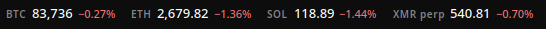
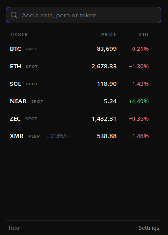
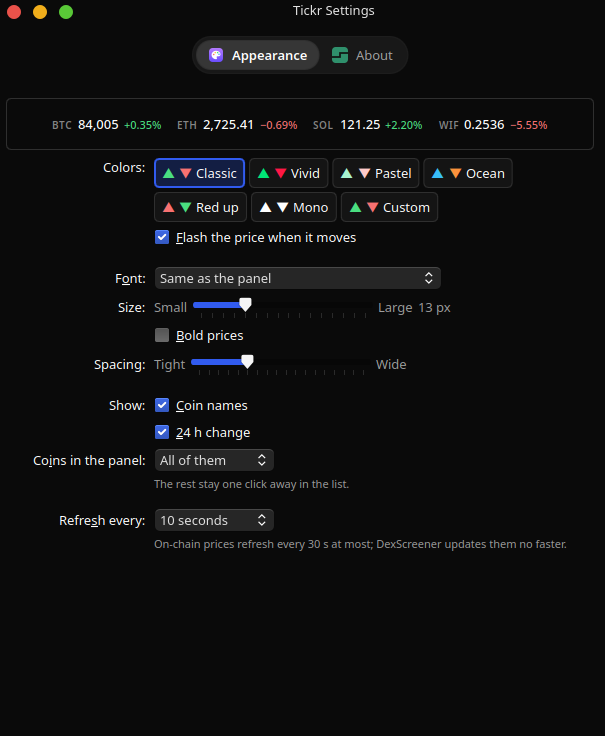

# Tickr

Crypto prices in the KDE Plasma 6 panel: spot pairs from Binance, perpetuals from Hyperliquid and any
on-chain token through DexScreener, with a click-to-open list. No account, no API keys.



| | |
|---|---|
|  |  |

## Features

- Click the ticker for a list of your coins; type in its search box to find coins on Binance,
  Hyperliquid and DexScreener at once. On-chain results are ranked by trading volume, so copycat
  tokens sink.
- Drag a coin to reorder it, × to remove it, click it to open its chart.
- Colour schemes, any installed font, size and spacing, with a live preview. Changes apply instantly.
- Halted or delisted pairs are marked instead of showing a frozen price.

## Install

From a release file:

```sh
kpackagetool6 -t Plasma/Applet -i tickr-<version>.plasmoid
```

From source (needs [Bun](https://bun.sh)): `./install.sh`

Then right-click the panel → Add Widgets → Tickr.

Tickr checks its GitHub releases every six hours and installs new versions itself, after verifying
their SHA-256. Both can be turned off in Settings → About. A new version loads when Plasma restarts.

## Privacy

Tickr contacts `data-api.binance.vision`, `api.hyperliquid.xyz` and `api.dexscreener.com` for the
coins you picked and what you type in the search, and `api.github.com` for updates. No identifiers,
no analytics.

## Develop

```sh
bun install
bun run check         # types, lint, unit tests, bundle loads in a real QML engine (needs PyQt6)
bun run test:live     # one call to each real API
bun run package       # dist/tickr-<version>.plasmoid
```

To release: bump the version in `package.json` and `package/metadata.json`,
then push a `vX.Y.Z` tag. The release workflow publishes `tickr-X.Y.Z.plasmoid`; the updater only
accepts files with that name and tag.

## Licence

MIT
